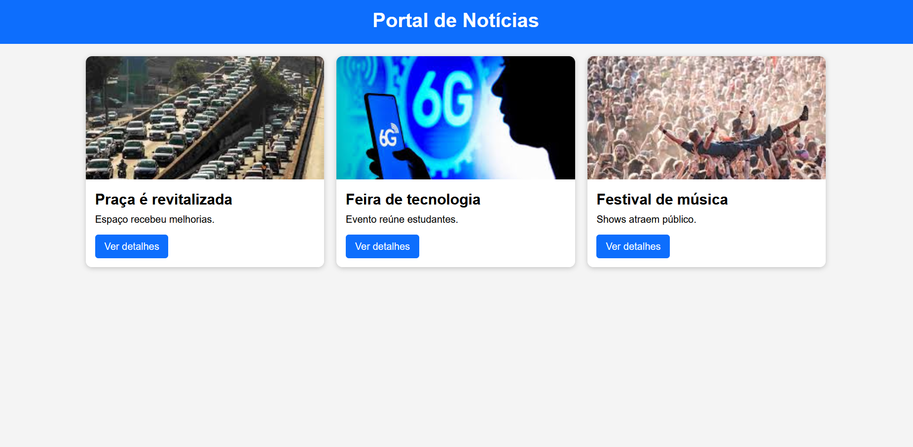
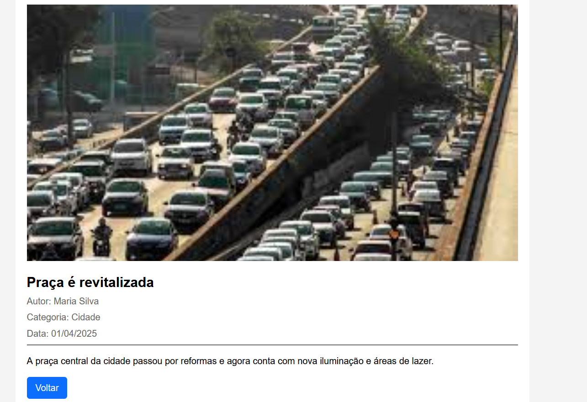

# Trabalho Prático - Semana 11

Nesta atividade, vamos evoluir o projeto em que estamos trabalhando nesse semestre, acrescentando a página de detalhes.

Imagine que a página principal (home-page) mostre um visão dos vários itens que existem no seu site. Ao clicar em um item, você é direcionado pra a página de detalhes. A página de detalhe vai mostrar todas as informações sobre o item do seu projeto, seja esse item uma notícia, filme, receita, lugar turístico ou evento.

## Informações Gerais

- Nome: Alexandre Soutelo Vilela
- Matricula: 917073
- Decreva brevemente seu projeto: Portal de notícias desenvolvido com HTML, CSS e JavaScript. As notícias são exibidas dinamicamente na página inicial e possuem uma página de detalhes com informações completas sobre cada notícia.

## Prints do trabalho




## Dados em JSON
Inclua aqui a estrutura de dados definida por você para o projeto com pelo menos dois exemplo de dados.

```json
{
  "noticias": [
    {
      "id": 1,
      "titulo": "Praça é revitalizada",
      "descricao": "Espaço recebeu melhorias.",
      "conteudo": "A praça central da cidade passou por reformas e agora conta com nova iluminação e áreas de lazer.",
      "categoria": "Cidade",
      "autor": "Maria Silva",
      "data": "01/04/2025"
    },
    {
      "id": 2,
      "titulo": "Feira de tecnologia",
      "descricao": "Evento reúne estudantes.",
      "conteudo": "A feira apresentou projetos de inovação desenvolvidos por alunos de escolas e universidades.",
      "categoria": "Tecnologia",
      "autor": "João Souza",
      "data": "02/04/2025"
    },
    {
      "id": 3,
      "titulo": "Festival de música",
      "descricao": "Shows atraem público.",
      "conteudo": "O festival contou com apresentações de artistas locais e grande participação da comunidade.",
      "categoria": "Cultura",
      "autor": "Ana Costa",
      "data": "03/04/2025"
    }
  ]
}
```


